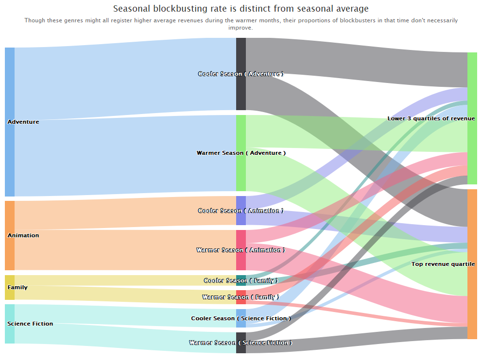

# *TMDb* Movie Analysis

## Overview

In a course I took at DePaul, _DSC 365 (Data Visualization)_, I took part in a final group project where we were asked to produce thoughtful visualizations for a dataset of our choice. We focused on a dataset of movies, pulled from _The Movie Database (TMDb)_.

Our full final report is available <a href='Final Project Submission.pdf'>here</a>. 

A quicker overview of our project is available <a href='Project_Overview.md'>here</a>.

  
## My Contributions
My main contributions to this report and project include:

- I wrote the "Visualization" and "Analysis & Discussion" sections of the report, which comprise eight of its ten pages.

- The last four figures of the nine featured, which I've copied below.

- I ensured consistency in the figures' source data and color coding (though I couldn't crack the Sankey's recoloring in time for submission.)

  
### Visualizations Contributed

#### Grouped Barchart
The Grouped Barchart of several Genres summertime shares of revenue and popularity:

  

  

#### Sankey
A Sankey to help break down how shares of a genres films fell into a cooler or warmer season, and then what shares of those earned revenue in the top quartile (thereby "blockbusting," I suggest):

  

  

#### Faceted Scatterplots #1
A set of Faceted Scatterplots, partly to underscore how revenue and popularity correlate for each of several genres. This visualization is one of two to also attempt to mitigate the overplotting near the origin.

  

  

#### Faceted Scatterplots #2
To highlight the concentration of points near the origin, I depict in the lower scatterplot a "zooming in" on part of the upper scatterplot. In that lower graph, I add a 2D-density plot further underscore the persistent concentration of points near the origin.

  

  
