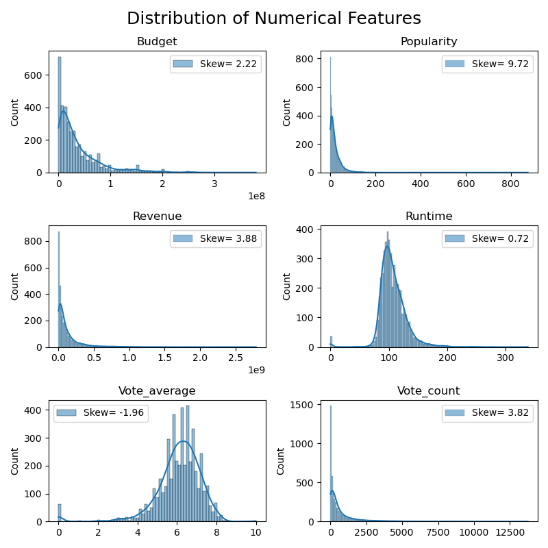
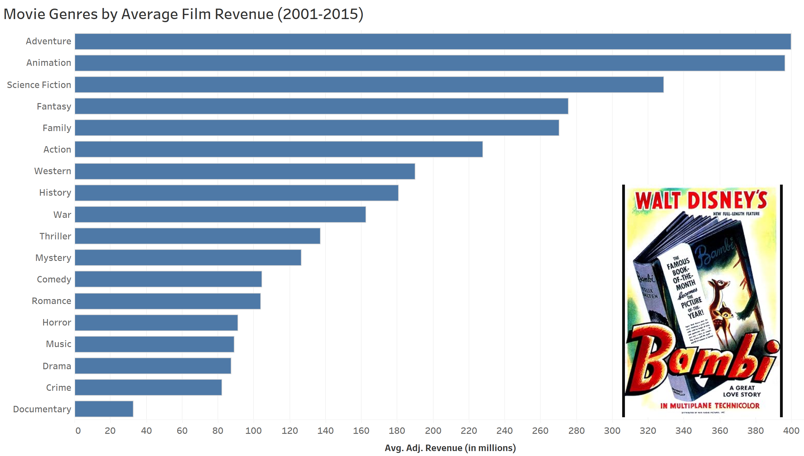
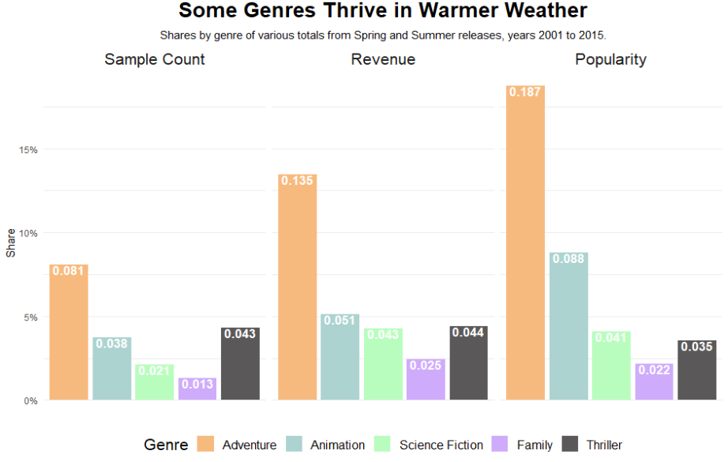
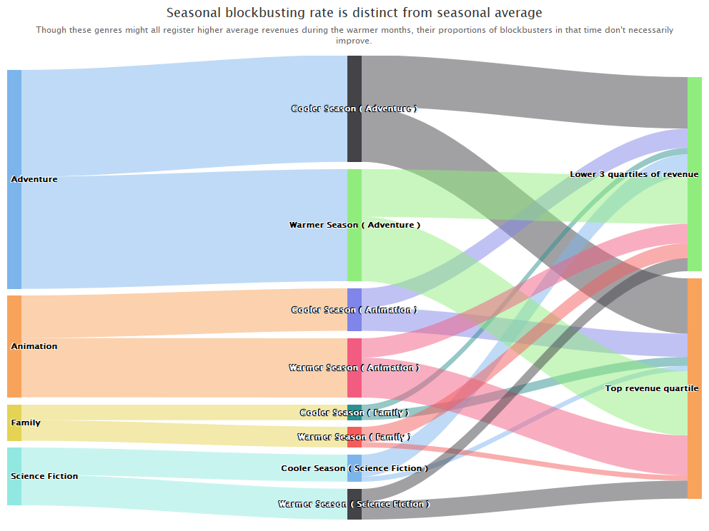
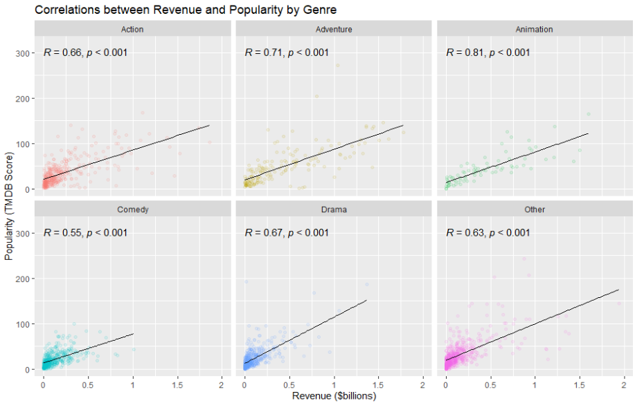
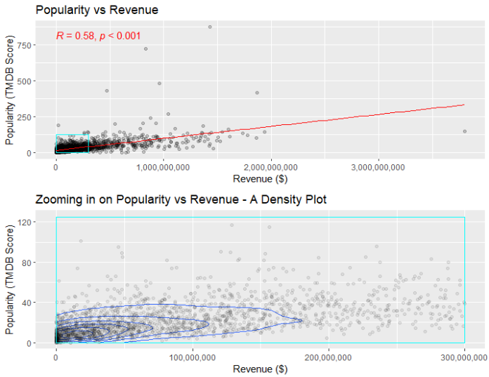
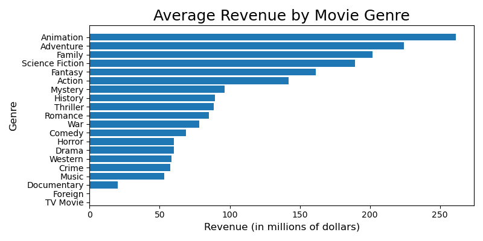
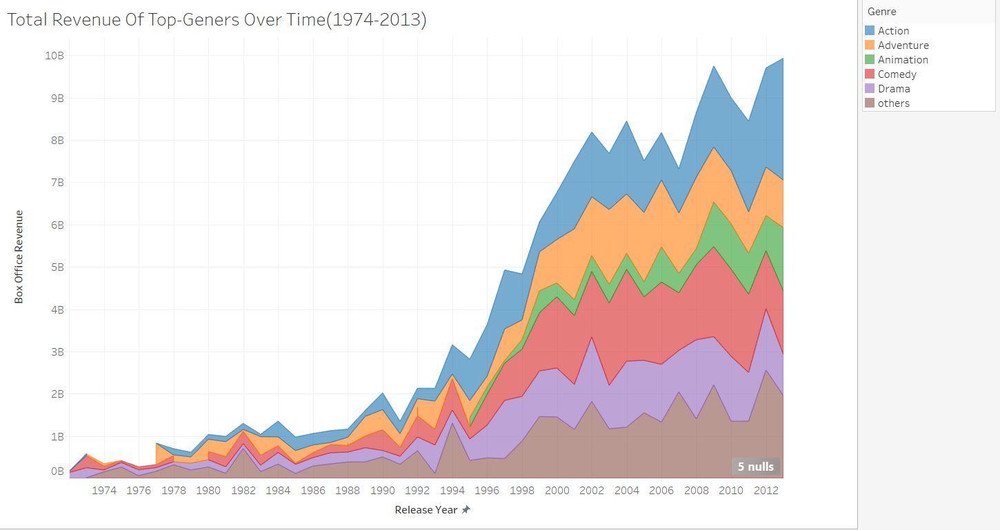

<!-- # DSC 365 Final Project: Movie Analysis
**Team Members:**  
- George Tzimas  
- Maxwell Ruther  
- Gulbanu Madiyarova  
- Nitheesh Samiappan  
- Rohith Reddy Patlolla  
- Anwesh Ramesh  

**Date:** March 2024  

## Table of Contents
- [Introduction](#introduction)
- [Exploratory Data Analysis](#exploratory-data-analysis)
- [Visualizations](#visualizations)
  - [Revenue by Genre, Broadly](#revenue-by-genre-broadly)
  - [Identifying and Examining Seasonal Boosts](#identifying-and-examining-seasonal-boosts)
  - [Correlation between Revenue and Popularity](#correlation-between-revenue-and-popularity)
- [Analysis and Discussion](#analysis-and-discussion)
- [References](#references)
- [Appendices](#appendices)

## Introduction
Our dataset includes variables such as Title, Runtime, Genre, Revenue, Budget, Profit, Director, Actor, Production Company, Awards, Oscar Awards, Season, Year, and Release Date. Key variables for drawing conclusions include revenue, profit, genre, budget, director, actor, and awards. These variables provide insights into financial performance, popular genres, critical acclaim, and potential correlations between creative talents and movie success.

Movies have been a cornerstone of entertainment ever since their introduction in the early 20th century. From early black-and-white films to modern CGI blockbusters, they have evolved through technological advancements and cultural changes while maintaining thematic messages and genres that impart sentiments and emotional experiences to audiences.

In this project, we explore movies through the lens of genre to unveil which genres have the biggest impact in terms of revenue and popularity. We focus on movies released between 2001 and 2015, with the primary dataset provided by Kaggle [The Movie Database (TMDB), 2017]. Additional features were added through TMDB’s API and feature engineering.

## Exploratory Data Analysis
The first stage of exploration involved reviewing the main numeric features in the dataset and their distributions. We hypothesized that some features may be correlated, providing valuable insights for further analysis.

### Observations
- **Correlation Analysis:** There is a positive correlation between popularity and revenue (0.65), leading us to explore these metrics further.
- **Distribution by Genre:** Non-uniform distribution of average revenue by genre suggests interesting insights in terms of genre performance.

## Visualizations

### Revenue by Genre, Broadly
A horizontal bar chart shows the average revenue for each genre. In the interactive version, hovering over a bar displays the top-earning movie of that genre.

### Identifying and Examining Seasonal Boosts
We explored how revenue by genre changes throughout the year. Some genres thrive during Spring and Summer, particularly Adventure, Animation, Science Fiction, and Family.

### Correlation between Revenue and Popularity
We examined the correlation between revenue and popularity. Despite moderate correlation overall (0.58), the correlation varies by genre.

## Analysis and Discussion
### Main Results
1. **Animation Genre Performance:** Despite relatively few films, the Animation genre ranks in the top 5 for revenue.
2. **Seasonal Trends:** Adventure, Animation, Family, and Science Fiction genres perform particularly well in Spring and Summer.
3. **Correlation Analysis:** The Animation genre has a strong correlation between revenue and popularity (0.81).

### Further Analysis
Further statistical techniques such as regression analysis and clustering can validate hypotheses generated from visualizations.

## References
1. [The Movie Database (TMDB), 2017] The Movie Database (TMDB) (2017). TMDB 5000 movie dataset. [Kaggle Link](https://www.kaggle.com/datasets/tmdb/tmdb-movie-metadata). Accessed: 2024-03-18.

## Appendices
- **Appendix A:** Individual Team Member Reports
- **Appendix B:** Code Implementations (Python and R)

### Acknowledgments
We would like to thank our instructors and colleagues for their guidance and support throughout this project.

---
 -->

# DSC 365 Final Project: Movie Analysis
**Team Members:**  
- George Tzimas  
- Maxwell Ruther  
- Gulbanu Madiyarova  
- Nitheesh Samiappan  
- Rohith Reddy Patlolla  
- Anwesh Ramesh  

**Date:** March 2024  

## Table of Contents
- [Introduction](#introduction)
- [Exploratory Data Analysis](#exploratory-data-analysis)
- [Visualizations](#visualizations)
  - [Revenue by Genre, Broadly](#revenue-by-genre-broadly)
  - [Identifying and Examining Seasonal Boosts](#identifying-and-examining-seasonal-boosts)
  - [Correlation between Revenue and Popularity](#correlation-between-revenue-and-popularity)
- [Analysis and Discussion](#analysis-and-discussion)
- [Individual Reports](#individual-reports)
- [References](#references)

## Introduction
Our dataset includes variables such as Title, Runtime, Genre, Revenue, Budget, Profit, Director, Actor, Production Company, Awards, Oscar Awards, Season, Year, and Release Date. Key variables for drawing conclusions include revenue, profit, genre, budget, director, actor, and awards. These variables provide insights into financial performance, popular genres, critical acclaim, and potential correlations between creative talents and movie success.

Movies have been a cornerstone of entertainment ever since their introduction in the early 20th century. From early black-and-white films to modern CGI blockbusters, they have evolved through technological advancements and cultural changes while maintaining thematic messages and genres that impart sentiments and emotional experiences to audiences.

In this project, we explore movies through the lens of genre to unveil which genres have the biggest impact in terms of revenue and popularity. We focus on movies released between 2001 and 2015, with the primary dataset provided by Kaggle [The Movie Database (TMDB), 2017]. Additional features were added through TMDB’s API and feature engineering.

## Exploratory Data Analysis
The first stage of exploration involved reviewing the main numeric features in the dataset and their distributions. We hypothesized that some features may be correlated, providing valuable insights for further analysis.

Figure 1: Early stages of exploratory data analysis.

### Observations
- **Correlation Analysis:** There is a positive correlation between popularity and revenue (0.65), leading us to explore these metrics further.
- **Distribution by Genre:** Non-uniform distribution of average revenue by genre suggests interesting insights in terms of genre performance.

## Visualizations

### Revenue by Genre, Broadly
A horizontal bar chart shows the average revenue for each genre. In the interactive version, hovering over a bar displays the top-earning movie of that genre.

Figure 2: Average revenue by movie genre from 2001 to 2015.

### Identifying and Examining Seasonal Boosts
We explored how revenue by genre changes throughout the year. Some genres thrive during Spring and Summer, particularly Adventure, Animation, Science Fiction, and Family.

Figure 3: Heatmap of average revenues by genre and month.

A bar chart comparing "warm season" genres against Thriller reveals how these genres achieve higher shares of popularity and revenue during Spring and Summer.

Figure 4: Genres like Adventure, Animation, and Family earn higher shares in warmer months.

The Sankey diagram below illustrates which genres are likely to release a blockbuster in warmer seasons.

Figure 5: Warm season genres don't necessarily release more blockbusters.

### Correlation between Revenue and Popularity
We assessed the linear correlation between revenue and popularity, using faceted scatterplots to analyze specific genres.

Figure 6: Correlation between revenue and popularity varies by genre.

The following graph provides an overall correlation value, highlighting the concentration of points in the density plot.

Figure 7: Overall correlation between revenue and popularity.

## Analysis and Discussion
### Main Results
1. **Animation Genre Performance:** Despite relatively few films, the Animation genre ranks in the top 5 for revenue.
2. **Seasonal Trends:** Adventure, Animation, Family, and Science Fiction genres perform particularly well in Spring and Summer.
3. **Correlation Analysis:** The Animation genre has a strong correlation between revenue and popularity (0.81).

### Further Analysis
Further statistical techniques such as regression analysis and clustering can validate hypotheses generated from visualizations.

## Individual Reports
### George Tzimas
**Contributions:**
- Performed the initial data cleaning and feature engineering.
- Created preliminary visualizations and outlined the project milestones.
- Acted as the group liaison, scheduling meetings and coordinating tasks.

**Visualizations:**

Figure 8: Average revenue by genre.

### Maxwell Ruther
**Contributions:**
- Wrote the "Visualization" and "Analysis & Discussion" sections.
- Reworked core visualizations to improve data message coherence.
- Ensured consistency in color-coding and data preprocessing.

**Visualizations:**

Figure 9: Overall correlation between revenue and popularity.

### Gulbanu Madiyarova
**Contributions:**
- Created exploratory visualizations and innovative heatmaps.
- Actively contributed to group discussions with insights.

**Learning Experience:**
- Learned to identify clutter and misleading visuals.
- Improved ability to criticize and refine visuals.

### Nitheesh Samiappan
**Contributions:**
- Created bar charts, scatter plots, and mosaic plots.
- Worked on side-by-side bar charts contrasting revenue and awards.

**Learning Experience:**
- Learned to utilize axis ranges effectively.
- Improved proficiency in R Studio and Tableau.

### Rohith Reddy Patlolla
**Contributions:**
- Produced creative visualizations for revenue patterns.
- Participated in group discussions and ensured project goals were met.

**Visualizations:**

Figure 10: Area chart of revenue over time.

### Anwesh Ramesh
**Contributions:**
- Crafted bar charts, line charts, and area charts.
- Participated in group reviews and discussions.

## References
1. [The Movie Database (TMDB), 2017] The Movie Database (TMDB) (2017). TMDB 5000 movie dataset. [Kaggle Link](https://www.kaggle.com/datasets/tmdb/tmdb-movie-metadata). Accessed: 2024-03-18.
